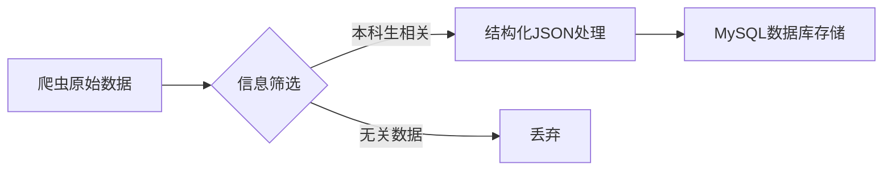

# 信息处理流程

# 代码框架
| 文件/目录                    | 功能描述                                                                                                                                                        |
|--------------------------|-------------------------------------------------------------------------------------------------------------------------------------------------------------|
| `ai_processing.py`       | 主执行程序，写有数据处理的代码，完成信息处理，导入数据库的工作。接口是待处理的md文档的本地路径MARKDOWN_PATH                                                                                               |
| `prompt_structuring.txt` | 数据结构化的提示词                                                                                                                                                   |
| `db_importer.py`         | json导入模块，包含： - `save_to_database()` 数据插入函数 - `generate_sql()` SQL生成函数 - `process_item()`  `parse_datetime()` 数据清洗函数 - `is_url_exists()` url查重函数 |

# 相关配置
1. 接口路径MARKDOWN_PATH，要求接收md格式的文档
2. 输入的md文档必须要在开头**附上原文链接**，且格式**必须**为：“|原文链接|: https://xxx”（支持http和https），在第二行附上发布日期，格式**必须**为：“|发布日期|: 2025-5-20”
3. 大模型API设置
4. 数据库配置DB_CONFIG，数据库提前建好表并创建url索引

# 后续优化
把报错存入日志，便于检查
